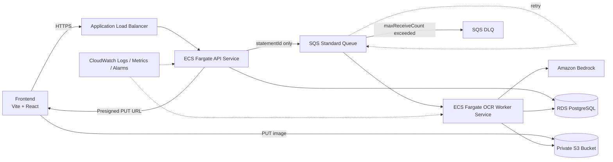
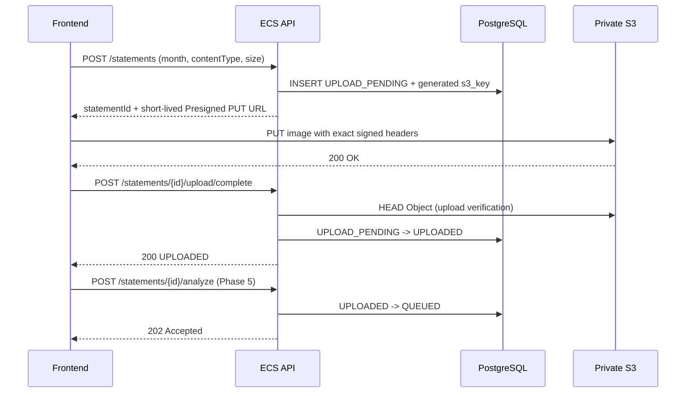
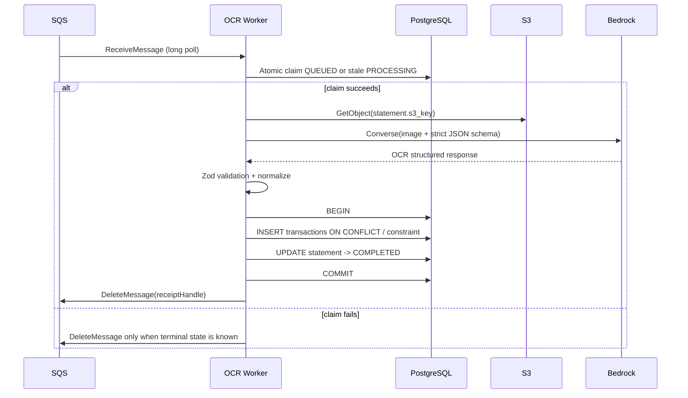
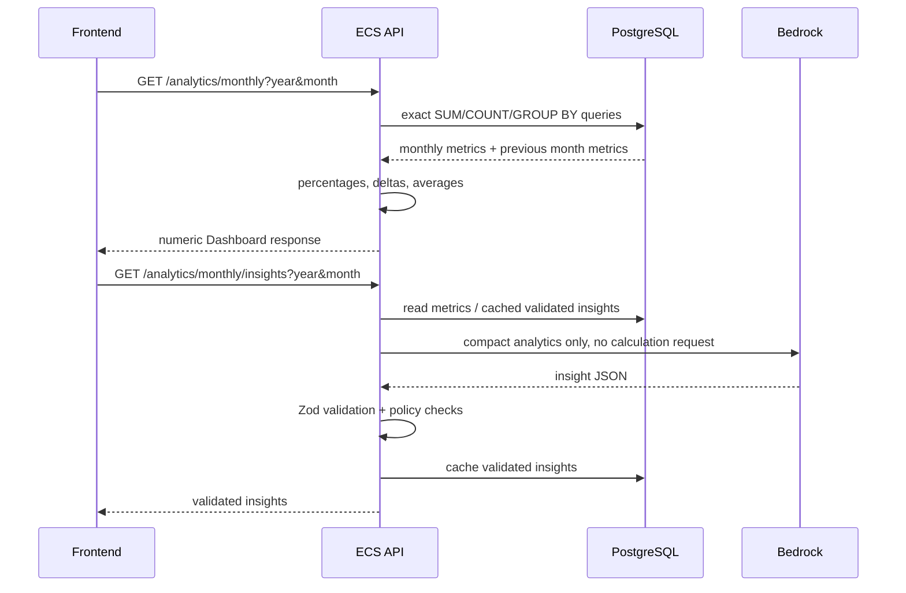

# ARCHITECTURE.md

## 設計方針

ユーザー操作への応答と、時間のかかるAI処理を分離する。Frontendは画像本体をAPIへ送らず、APIはアップロード情報とジョブの状態を扱う。WorkerだけがS3・Bedrock・OCR用DB処理を担当する。



## AWS配置

- Regionは原則 `ap-northeast-1`（Tokyo）。VPC、ECS Cluster、API Service、Worker Service、RDS、S3、SQS、DLQを同一リージョンに置く。
- ECS Clusterは1つだけ作り、APIとWorkerは別Serviceにする。Worker専用VPCやClusterは作らない。
- ALBはPublic Subnet、ECS API / WorkerはPrivate Subnet、RDSはDB Private Subnetに置く。
- ECS APIとWorkerは同じECR Imageを使い、ECSのcommandだけを変える案をMVPの推奨とする。APIとWorkerのTask Roleは分離する。
- S3はPhase 4のCDK `StorageStack`で作成し、非公開、Block Public Access有効、暗号化、Lifecycleを設定する。Phase 13では同じバケットを参照する。FrontendはAWS Credentialsを持たない。
- RDSへのInboundはAPI / WorkerのSecurity Groupからのみ許可する。RDSからInternetへの通信は不要な設計を目標にする。
- ALBはHTTPSを正規入口とし、ACM証明書でTLS終端する。HTTPはHTTPSへredirectする。

## APIとWorkerの責務

| Component | 責務 | しないこと |
|---|---|---|
| Frontend | ファイル選択、Presigned PUT、状態ポーリング、Dashboard表示 | AWS Secret保持、金額集計、AIレスポンスの無検証表示 |
| API | statement作成、Presigned URL発行、SQS投入、DB参照、SQL Analytics | 画像を受け取る、Bedrock OCRを同期実行 |
| OCR Worker | SQS受信、S3取得、Bedrock OCR、Zod検証、DB Transaction、ack | HTTPリクエストを待ち続ける |
| PostgreSQL | 状態、構造化取引、制約、正確な集計 | LLMの解釈 |
| Bedrock | OCR、merchant正規化、分類、Analyticsの解釈 | 金額の確定計算、DB整合性保証 |

## Upload Sequence



APIは画像本体を受信しないため、APIのメモリ・timeout・帯域が画像サイズに直接依存しにくい。Presigned URLはbearer tokenなので、TTLを短くし、レスポンスやログに残さない。

## OCR Sequence



`COMMIT`を先にする。COMMIT後にWorkerが停止してもMessageが再配送され、次のWorkerは状態またはUNIQUE制約で安全にskipできる。Deleteを先にすると、Delete後DB保存前の停止でジョブが消失する。

## Retry Sequence

```mermaid
sequenceDiagram
    participant Q as Main Queue
    participant W as Worker
    participant DB as PostgreSQL
    participant DLQ as DLQ

    Q->>W: ReceiveMessage
    W->>W: classify error
    alt transient error
        W->>Q: do not delete; visibility expires
        Q->>W: redelivery
    else permanent input/validation error
        W->>DB: FAILED + failure_code
        W->>Q: DeleteMessage
    else repeated failure
        Q->>DLQ: redrive after maxReceiveCount
        W->>DB: reconcile FAILED if still PROCESSING
    end
```

AWS SDKの内部RetryとSQSの再配送は別物である。SDKの短い通信Retryで回復できるものはSDKに任せ、Worker処理全体が失敗した場合はMessageを削除せずSQSのVisibility Timeoutとredrive policyに任せる。Validation不能な入力を無限Retryしない。

## Analytics Sequence



数値DashboardはBedrock障害から独立させる。Insightsは別Endpoint・別キャッシュにするため、レイテンシー、費用、失敗の影響範囲を分離できる。

## DBとSQSの境界

`POST /statements/{id}/analyze` はDB更新とSQS `SendMessage`を同一ACID Transactionにはできない。MVPは以下の二段構えで実装する。

1. statementを条件付きで `QUEUED` にし、idempotency keyとして同じstatementIdを使う。
2. SQS SendMessageに失敗した場合は、statementを再キュー可能な状態に戻すか、reconciliation jobが一定時間後に再送する。

本番で送信漏れをより厳密に防ぐ場合は、同一DB Transaction内にOutbox行を保存し、Outbox PublisherがSQSへ送る方式を採用する。Outboxを最初から入れると学習対象が増えるため、Phase 5で直接送信方式を実験し、Phase 13で採否を再確認する。

## 障害時の挙動

| 障害 | 次に起きること | データ保護 |
|---|---|---|
| Bedrock成功後、DB保存前にWorker停止 | Messageがvisibility期限後に再配送 | DB未COMMITなので再処理できる |
| DB COMMIT後、Delete前にWorker停止 | Messageが再配送 | status / UNIQUE制約で二重登録を防ぐ |
| Worker A/Bが同じMessageを取得 | Atomic claimの片方だけ成功 | 片方は処理せず、必要ならMessageをackする |
| PROCESSING中にWorker永久停止 | lease期限超過後、別Workerが再claim | processing tokenで古いWorkerの更新を防ぐ |
| Validation不能 | `FAILED`、failure_code記録、Messageはack | 不正AI値をDBへ保存しない |
| Bedrock throttling / Network障害 | ackせずSQS再Retry | maxReceiveCount超過でDLQ |
| DLQにMessageが入る | Alarm、運用者が原因を確認 | 自動再実行は承認後に行う |

## 現行仕様確認の要点

- Bedrock Model IDは環境変数化し、実装時にModel Card、画像入力、Converse、Structured Output、Region、料金を再確認する。
- 現時点の推奨はClaude Haiku 4.5のJP inference profileで、Structured Outputを使用する案。Nova Liteは東京で画像入力可能だがStructured Output非対応なので、明示的な代替案とする。
- Private SubnetからBedrock Runtimeを呼ぶ場合は、NATまたはBedrock Runtime Interface VPC Endpointが必要。S3はGateway Endpointを優先する。

## 参照

- [Bedrock model API compatibility](https://docs.aws.amazon.com/bedrock/latest/userguide/models-api-compatibility.html)
- [Bedrock Structured Outputs](https://docs.aws.amazon.com/en_en/bedrock/latest/userguide/structured-output.html)
- [Claude Haiku 4.5 model card](https://docs.aws.amazon.com/bedrock/latest/userguide/model-card-anthropic-claude-haiku-4-5.html)
- [Amazon Nova Lite model card](https://docs.aws.amazon.com/bedrock/latest/userguide/model-card-amazon-nova-lite.html)
- [SQS visibility timeout](https://docs.aws.amazon.com/AWSSimpleQueueService/latest/SQSDeveloperGuide/sqs-visibility-timeout.html)
