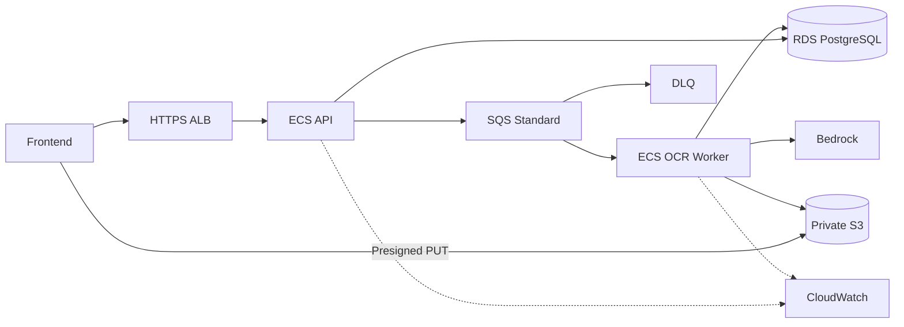
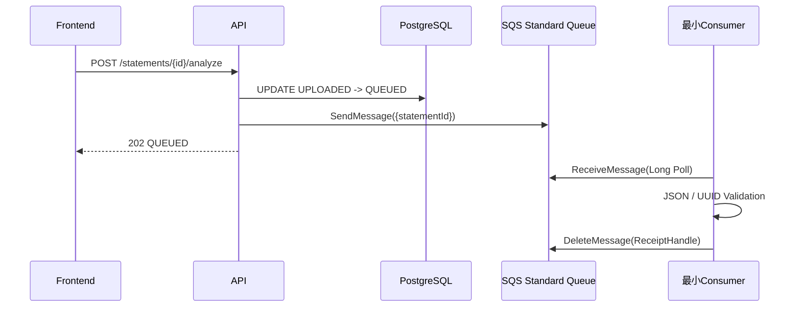
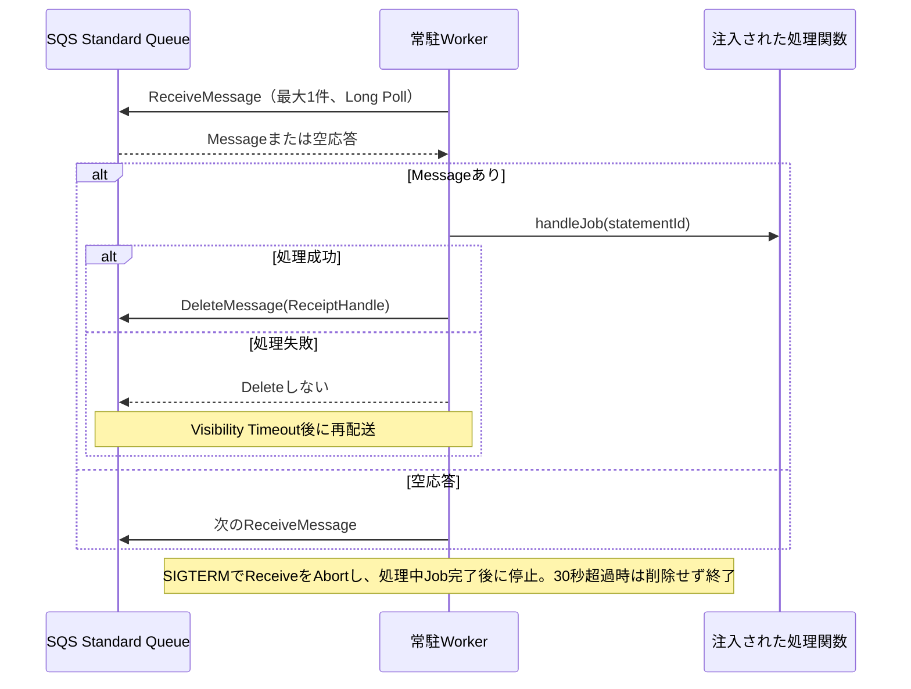
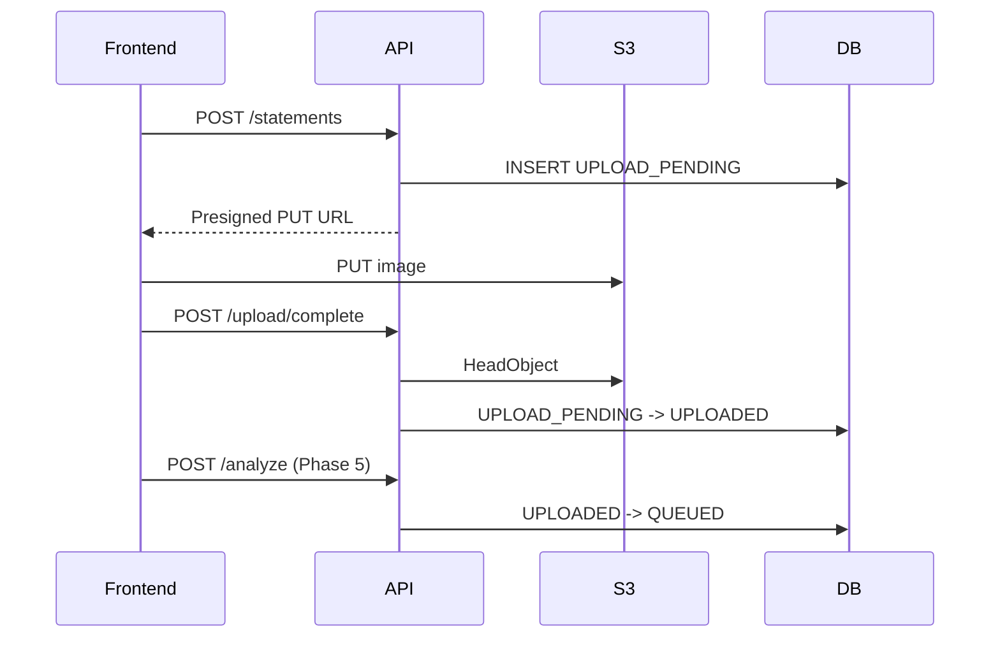
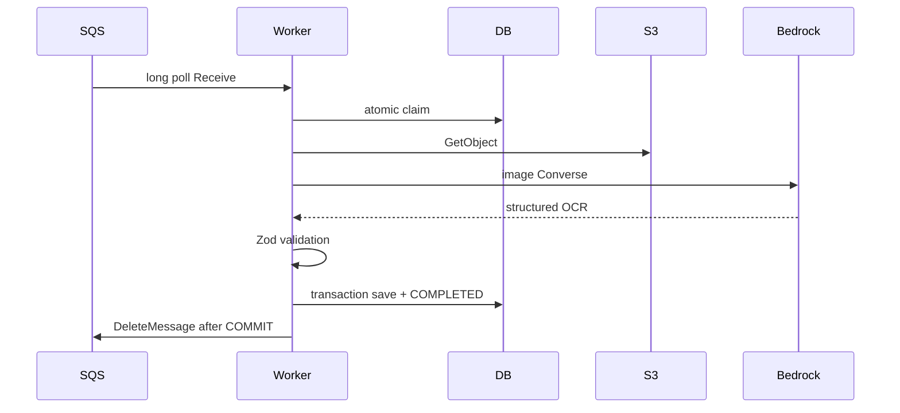
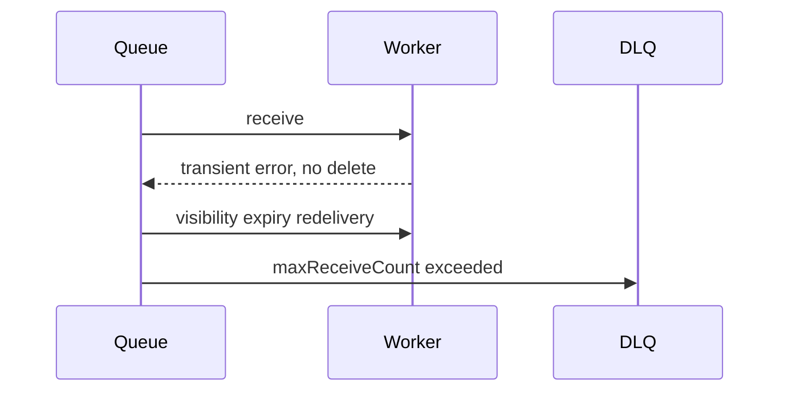
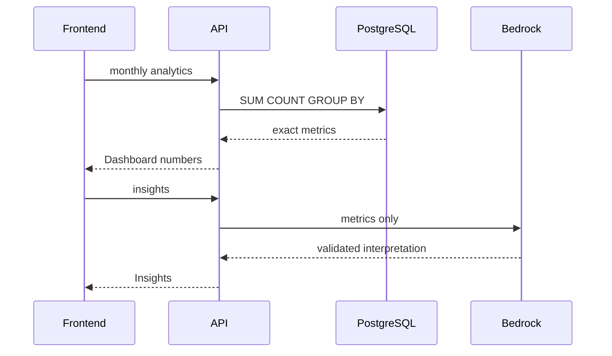

# Architecture Reference

設計の正本は [../ARCHITECTURE.md](../ARCHITECTURE.md)。このページは実装Phaseで参照するsequence集である。

## AWS Architecture

### Phase 5 / Phase 6の実装範囲

Phase 5で実際に動くのは、APIからMain Queueへの送信と、1回だけ動く最小ConsumerによるReceive / Validation / Deleteである。Phase 6では、ローカルで常駐Workerを起動し、SQS Long Polling、1件ずつの処理、成功後ACK、SIGTERMによるGraceful Shutdownを実装した。S3 GetObject、Bedrock、DB Transaction、ECS Serviceへのデプロイは後続Phaseで実装する。

### Phase 6 Worker Sequence

## Upload Sequence

## OCR Sequence

## Retry Sequence

## Analytics Sequence

