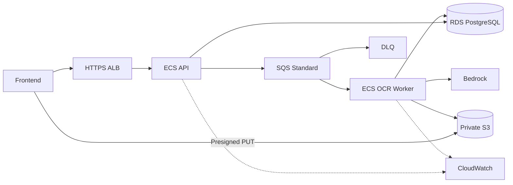
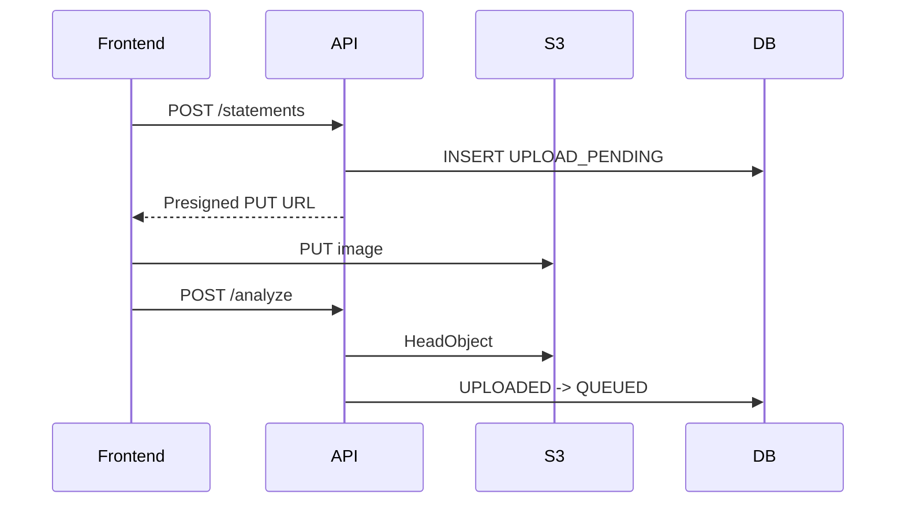
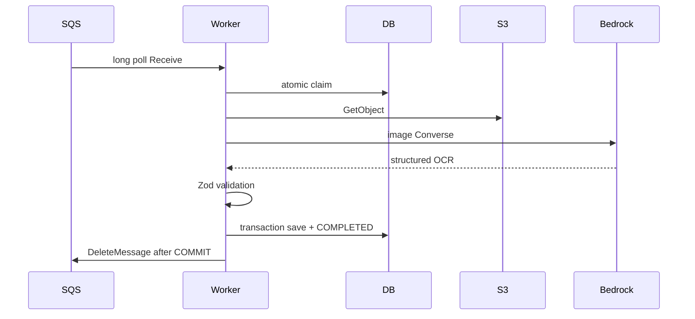
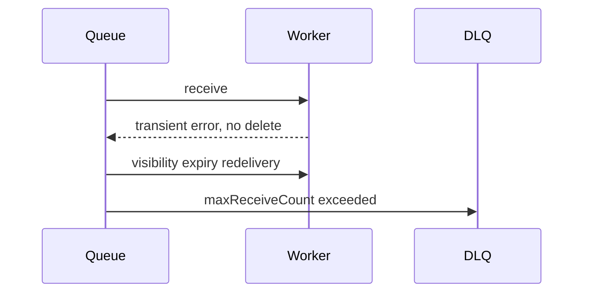
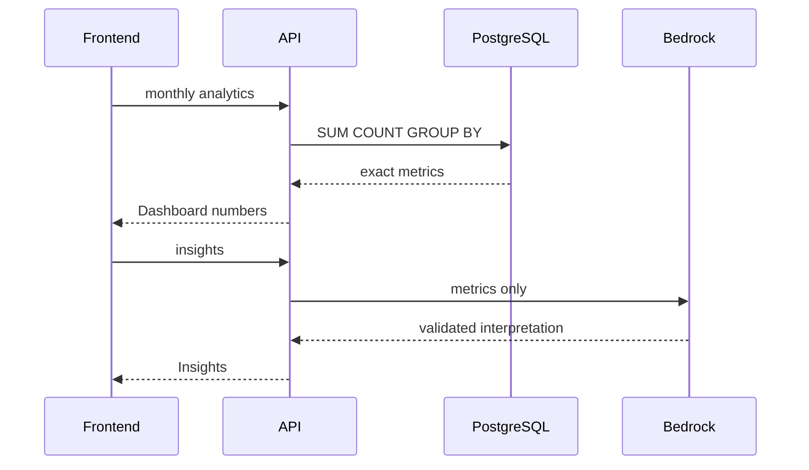

# Architecture Reference

設計の正本は [../ARCHITECTURE.md](../ARCHITECTURE.md)。このページは実装Phaseで参照するsequence集である。

## AWS Architecture

## Upload Sequence

## OCR Sequence

## Retry Sequence

## Analytics Sequence

